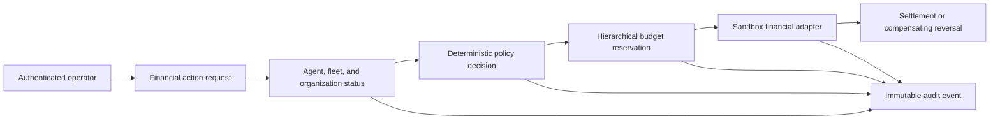
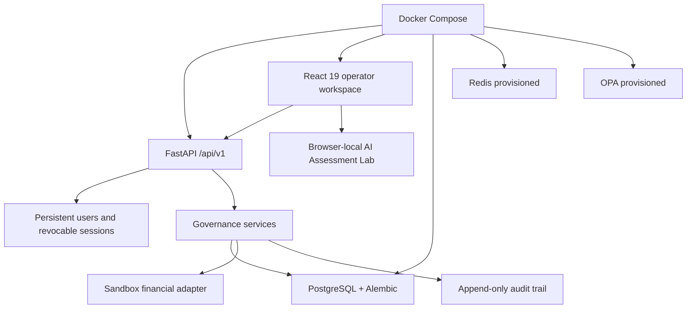

# NorseAI

NorseAI is a production-oriented governance platform for autonomous financial agents. Every
payment, transfer, or refund passes through policy evaluation, hierarchical budget enforcement,
fleet and organization status checks, idempotent execution, and an immutable audit trail before a
sandbox adapter can settle it.

The authenticated Operator Governance Platform is the primary experience. A separate AI
Assessment Lab demonstrates deterministic risk and compliance analysis for high-impact AI systems.

## What the platform demonstrates

1. **Financial Agent** — register agents and assign them to governed fleets.
2. **Governance Decision** — apply deterministic allow, deny, and conditional policies.
3. **Budget Enforcement** — enforce transaction, daily, and monthly limits at agent, fleet, and
   organization scope.
4. **Fleet Governance** — group agents under organization-owned fleets and control fleet status.
5. **Emergency Stop** — disable or suspend agents and stop an entire fleet immediately.
6. **Audit Trail** — retain append-only decisions with actor, request, correlation, policy, budget,
   and execution context; export evidence as CSV or JSONL.
7. **Operator Dashboard** — monitor active agents, fleets, budget utilization, emergency state,
   recent actions, and audit events.
8. **AI Assessment Lab** — run deterministic AI risk assessments and export executive reports as
   PDF, JSON, or CSV.

## Governance workflow



The server is the enforcement boundary. Operators submit and reverse governed transactions from
the **Financial Actions** dashboard page; that page uses the protected financial gateway, and no
browser-side path can bypass policy, status, or budget enforcement.

## Architecture



Redis and OPA are provisioned in Compose but are not in the current decision execution path.
Policies are evaluated by the deterministic application service. The Assessment Lab is isolated
from operational financial records and uses validated browser-local storage.

## Technology

| Layer | Implementation |
| --- | --- |
| Operator UI | React 19, TypeScript, Vite, React Router, TanStack Query |
| Assessment Lab | React Hook Form, Zod, Recharts, jsPDF |
| API | FastAPI, Pydantic, SQLAlchemy |
| Persistence | PostgreSQL, Alembic |
| Security | JWT access tokens, rotating refresh sessions, scrypt hashes, RBAC, rate limiting |
| Delivery | Docker, Nginx, Docker Compose, GitHub Actions |
| Quality | Pytest, Vitest, Testing Library, Ruff, Black, ESLint, Prettier |

## Quick Start

Requirements: Docker Desktop (Windows/macOS) or Docker Engine with Docker Compose v2 (Linux).

```text
git clone https://github.com/bhavukm007/NorseAI.git
cd NorseAI
```

### Windows

```powershell
.\run.ps1
```

### Linux/macOS

```bash
chmod +x run.sh
./run.sh
```

The runner verifies Docker and Compose, creates `.env` from `.env.example` when needed, checks the
configured ports, builds the containers, waits for every service health check, and prints the
frontend, backend, Swagger URLs, and first-run demo credentials. Existing `.env` files are never
overwritten.

### First login

On the first development startup, NorseAI creates one demo administrator:

```text
Username: admin
Password: admin123
```

Open `http://localhost:3000`, enter those credentials on the login page, and select **Sign in**.
The account is created only when no user named `admin` exists, so restarting the application never
creates duplicates or resets an existing password.

The bootstrap account is for local development and demonstrations only. Change
`OPERATOR_USERNAME` and `OPERATOR_PASSWORD` before sharing or deploying the application. Demo
bootstrap is disabled in staging and production environments.

Interactive API documentation is available at `http://localhost:8000/docs`; its OpenAPI schema is
available at both `http://localhost:8000/openapi.json` and
`http://localhost:8000/api/v1/openapi.json`.

Stop the stack with `.\stop.ps1` on Windows or `bash stop.sh` on Linux/macOS. To remove containers,
PostgreSQL/Redis volumes, and unused Docker data, run `.\clean.ps1` or `bash clean.sh`; cleanup
requires typing `CLEAN` before any data is removed.

If `make` is available, the equivalent commands are `make run`, `make stop`, `make logs`, and
`make clean`.

## Local setup

Requirements: Python 3.11+, Node.js 20+, and PostgreSQL. Copy `.env.example` before starting the
API and replace its demonstration secrets when the environment is shared or exposed.

```powershell
python -m venv .venv
.\.venv\Scripts\Activate.ps1
python -m pip install -r requirements-dev.txt
Copy-Item .env.example .env
python -m alembic upgrade head
uvicorn backend.app.main:app --reload
```

In a second terminal:

```powershell
Set-Location frontend
npm ci
npm run dev
```

Open `http://localhost:5173` and sign in with `APP_OPERATOR_USERNAME` and
`APP_OPERATOR_PASSWORD` (`admin` / `admin123` in an unchanged `.env.example`). Development API
documentation is available at `http://localhost:8000/docs`.

The development bootstrap operator is created only when that username does not already exist.
Passwords are stored as scrypt hashes, not plaintext. Staging and production never create a demo
operator automatically.

### Complete operator workflow

The dashboard supports the complete governed transaction lifecycle:

1. **Login** — sign in with the configured bootstrap operator.
2. **Organizations** — create the top-level governance and budget scope.
3. **Fleets** — create a fleet and attach it to the organization.
4. **Agents** — create an enabled financial agent in that fleet.
5. **Policies** — create an allow, deny, or conditional policy and assign it to the agent.
6. **Budgets** — configure transaction, daily, and monthly limits for the organization, fleet,
   and agent.
7. **Financial Actions** — select the organization, fleet, and agent; enter a payment, transfer,
   or refund; then submit the governed action.
8. **Approval or denial** — inspect the on-page decision, policy reference, adapter reference, and
   audit reference. Denied requests never reach the adapter.
9. **Reversal** — reverse a settled transaction from the settled-transactions list.
10. **Audit Center** — filter the append-only evidence and export CSV or JSONL.
11. **Emergency** — emergency-stop the fleet, submit another action to verify denial, and confirm
    the resulting audit record.

## Container setup

Compose uses production defaults and requires explicit secrets:

```powershell
$env:JWT_SECRET = "<random value of at least 32 characters>"
$env:OPERATOR_PASSWORD = "<strong operator password>"
$env:POSTGRES_PASSWORD = "<strong database password>"
docker compose up --build
```

Open `http://localhost:3000`. The backend runs migrations before starting. For local-only
development, set `APP_ENVIRONMENT=development` and `APP_DOCS_ENABLED=true` explicitly.
If ports 3000 or 8000 are already occupied, set `FRONTEND_PORT`, `BACKEND_PORT`,
`FRONTEND_ORIGIN`, and `PUBLIC_API_BASE_URL` to matching alternate localhost values before
building. The defaults remain 3000 and 8000.

See [configuration and security architecture](docs/architecture/security-architecture.md) for the
complete environment variable reference.

## API overview

All application endpoints are below `/api/v1`.

| Area | Representative endpoints |
| --- | --- |
| Health | `GET /health` |
| Authentication | `POST /auth/login`, `/auth/refresh`, `/auth/logout`; `GET /auth/me` |
| Agents and policies | CRUD under `/agents` and `/policies`; assignments under `/permissions` |
| Organizations and fleets | `/organizations`, `/fleets`, fleet status and emergency actions |
| Budgets | `/spend-limits`, `/fleet-spend-limits`, `/organization-spend-limits` |
| Financial execution | `POST /financial-actions`, list actions, reverse a settled action |
| Audit | Filter `/audit-logs`; export `/audit-logs/export?format=csv|jsonl` |
| Dashboard | `GET /overview` |

See [API design](docs/api/api-design.md) for endpoints, authorization, errors, and decision
semantics.

## Judge-friendly walkthrough

Use the dashboard to create one organization, fleet, enabled financial agent, allow policy,
assignment, and budget at every scope.

1. **Sign in**, then open **Organizations**, **Fleets**, and **Agents** to create the hierarchy.
2. **Policies** — create and assign the authorization rule; explain default denial.
3. **Budgets** — configure agent, fleet, and organization limits.
4. **Financial Actions** — submit a governed payment and show its approved decision.
5. Reverse the settled transaction from **Financial Actions**.
6. **Emergency** — stop the fleet, return to **Financial Actions**, and show a denied request.
7. **Audit Center** — locate the approval, reversal, emergency stop, and denial evidence.
8. **AI Assessment Lab** — run the one-click assessment and export the executive report.

The recommended narration is in [the demo script](docs/submission/demo-script.md).

## Validation

```powershell
.\.venv\Scripts\python.exe -m ruff check backend tests migrations
.\.venv\Scripts\python.exe -m black --check backend tests migrations
.\.venv\Scripts\python.exe -m pytest
.\.venv\Scripts\python.exe -m alembic upgrade head --sql

Set-Location frontend
npm run lint
npm run format:check
npm test
npm run build
npm audit --audit-level=critical
```

Set `POSTGRES_TEST_DATABASE_URL` to run the PostgreSQL-marked integration test. CI also performs
Python dependency auditing, Bandit scanning, Compose validation, container builds, migration SQL
generation, and a PostgreSQL service test.

## Screenshots

Submission screenshots are stored under `PresentationAssets/Screenshots`; working capture assets
also exist under `ppt-images`. `frontend/public/og.jpg` is the social preview image, not a UI
screenshot. The cleanup disposition for working assets and runtime databases is documented in
`docs/submission/cleanup-report.md`.

- Operator Overview with live governance metrics
- Agents, fleets, policies, and hierarchical budgets
- Emergency fleet stop
- Audit Center with a governed financial decision
- AI Assessment Lab results and executive report

## Repository map

```text
backend/app/              API, models, repositories, services, security, adapter
frontend/src/features/    Authentication, operator governance, dashboard, assessment lab
migrations/               Ordered PostgreSQL schema migrations
tests/                    Backend unit, API, security, and PostgreSQL integration tests
docs/                     Architecture, API, database, phase, design, and submission material
.github/workflows/ci.yml  Security, quality, build, migration, and integration gates
```

## Scope boundary

Financial execution is intentionally sandboxed. NorseAI does not connect to a bank, payment
processor, production OPA policy bundle, or distributed Redis rate limiter. These boundaries are
documented rather than represented as implemented integrations.
