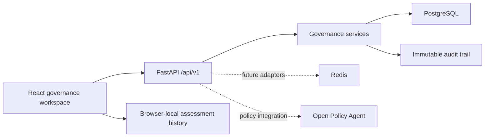

# NorseAI

NorseAI is an enterprise AI governance platform for registering autonomous agents, enforcing
policy and spend controls, evaluating AI-system risk, and producing audit-ready compliance
reports.

## The problem

Organizations adopting autonomous and high-impact AI need a consistent way to understand what
systems do, which rules apply, how risk is controlled, and who approved deployment. Evidence is
often distributed across spreadsheets, policy documents, and operational tools, making reviews
slow and difficult to audit.

## The solution

NorseAI combines a secure governance API with a polished assessment workspace. Teams can manage
agents and policies through authenticated APIs, then demonstrate the complete governance journey
in the AI Governance Simulator—from system submission and rule evaluation through risk scoring,
remediation, and an executive decision report.

## Product capabilities

- Validated AI-system intake with six enterprise demo scenarios
- Animated eight-stage governance assessment pipeline
- Privacy, security, fairness, transparency, accountability, and regulatory risk analysis
- Governance rule findings with passed, warning, and failed states
- Compliance KPIs and accessible animated data visualizations
- Prioritized, actionable remediation recommendations
- Executive report generation with PDF, JSON, and CSV exports
- Browser-local assessment history with reopen, comparison, and deletion
- One-click judge demo that completes in seconds
- Responsive light and dark themes with keyboard and screen-reader support
- Authenticated agent, policy, permission, spend-control, emergency-action, and audit APIs

## Architecture



The public simulator uses deterministic client-side assessment logic for a reliable hackathon
demonstration. Authenticated operational governance remains behind the FastAPI authorization
boundary and is not duplicated or bypassed by the simulator.

## Technology stack

| Layer | Technology |
| --- | --- |
| Frontend | React 19, TypeScript, Vite, React Router |
| Forms and state | React Hook Form, Zod, TanStack Query |
| UI and motion | Lucide, Framer Motion, responsive CSS design system |
| Visualization | Recharts |
| Report export | jsPDF, native JSON and CSV generation |
| Backend | FastAPI, Pydantic, SQLAlchemy |
| Persistence | PostgreSQL, Alembic |
| Security | JWT claims, role-based access control, deterministic policy precedence |
| Quality | Pytest, Vitest, Testing Library, ESLint, Prettier, Ruff, Black |

## Run locally

Requirements: Python 3.11+, Node.js 20+, and PostgreSQL for persistent governance APIs.

```powershell
python -m venv .venv
.\.venv\Scripts\Activate.ps1
python -m pip install -r requirements-dev.txt
copy .env.example .env
python -m alembic upgrade head
uvicorn backend.app.main:app --reload
```

In a second terminal:

```powershell
cd frontend
npm ci
npm run dev
```

Open `http://localhost:5173`. API documentation is available at `http://localhost:8000/docs` in
development. A full container stack can be started with `docker compose up --build`; the web
application is then served at `http://localhost:3000`.

Never use the example JWT or database secrets outside local development. Set a random
`APP_JWT_SECRET` of at least 32 bytes, restrict `APP_CORS_ORIGINS`, disable API documentation, and
use managed database credentials for staging or production.

## API overview

All governance routes are versioned below `/api/v1`. The health endpoint is public. Governance
resources require a signed bearer token with issuer, audience, lifetime, subject, username, and
role claims.

| Area | Representative endpoints |
| --- | --- |
| Health | `GET /health` |
| Agents | `POST /agents`, `GET /agents`, `PATCH /agents/{id}` |
| Policies | `POST /policies`, `GET /policies`, `PATCH /policies/{id}` |
| Decisions | `POST /permissions/evaluate`, `POST /spend/evaluate` |
| Emergency control | `POST /agents/{id}/disable`, `/suspend`, `/enable` |
| Audit | `GET /audit-logs` |

See [API design](docs/api/api-design.md) and the interactive development documentation for the
complete schemas and role matrix.

## Project structure

```text
backend/app/              FastAPI application, schemas, repositories, and services
frontend/src/app/         Routing and application composition
frontend/src/components/  Reusable layout, dashboard, chat, and feedback components
frontend/src/features/    Dashboard and governance simulator feature modules
frontend/src/styles/      Design tokens and responsive component styles
tests/                    Backend API, security, and integration tests
docs/                     Architecture, design, phase, and submission documentation
migrations/               Alembic database migrations
```

## Judge demo

1. Open the dashboard in either theme.
2. Select **Run judge demo**.
3. The Healthcare Diagnostic AI submission loads automatically.
4. Follow the animated governance pipeline to the completed risk and compliance dashboard.
5. Open the executive report and export it as PDF.
6. Return to assessment history to demonstrate persistence and comparison.

The complete automated flow takes well under one minute and does not depend on network access.
See the [demo script](docs/submission/demo-script.md) for the recommended narration.

## Quality checks

```powershell
.\.venv\Scripts\python.exe -m ruff check backend tests migrations
.\.venv\Scripts\python.exe -m black --check backend tests migrations
.\.venv\Scripts\python.exe -m pytest
cd frontend
npm run lint
npm run format:check
npm run test
npm run build
```

The optional PostgreSQL integration test requires `POSTGRES_TEST_DATABASE_URL`.

## Screenshots

Capture the final submission images at:

- Dashboard overview in light mode
- Automated governance pipeline
- Risk and compliance dashboard in dark mode
- Executive decision report

The repository includes a social preview at `frontend/public/og.jpg`.

## Roadmap

- Persist simulator assessments through authenticated organization workspaces
- Add regulation-specific control packs and evidence attachments
- Connect live OPA decisions and portfolio analytics
- Add signed report attestations and scheduled reassessments
- Extend notification and collaboration integrations

## Team

Built by the NorseAI team for the AI governance hackathon. Add final contributor names and contact
details here before public submission if required by the event.
