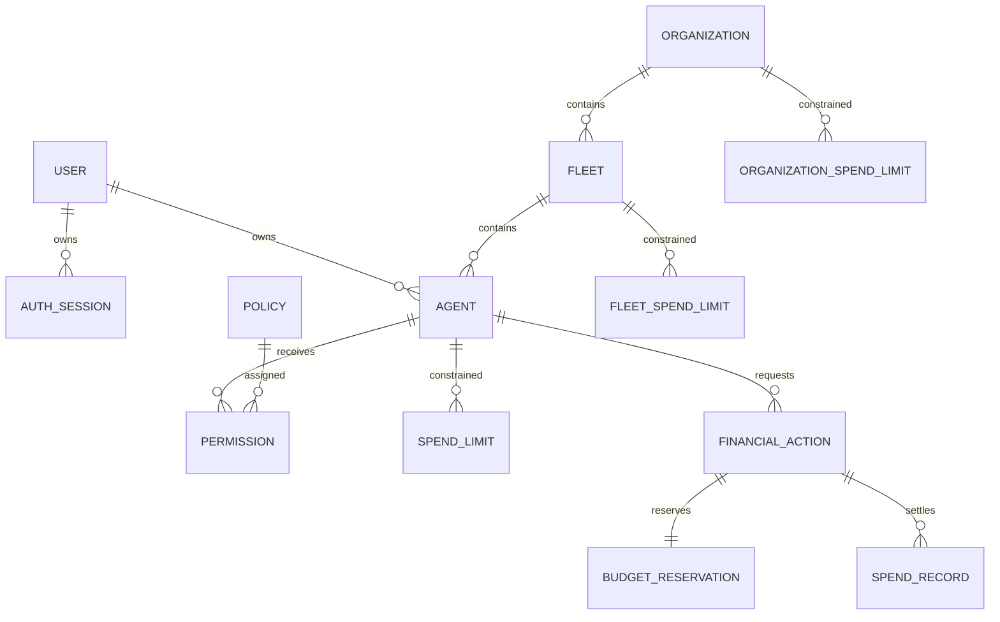

# Database architecture

PostgreSQL is the production system of record. SQLAlchemy defines the runtime model and Alembic
owns three ordered migrations:

1. `f4a07a376d4e` — users, agents, policies, permissions, agent limits, spend records, audit
   immutability
2. `a6f06b9c2d11` — organizations, fleets, hierarchical budgets, financial actions, reservations,
   reversals, expanded audit evidence
3. `c83f15d908a2` — password/session state, request and correlation context, policy versions

Audit records retain reference identifiers without cascading foreign keys so deletion of a source
entity cannot erase historical evidence. PostgreSQL triggers reject audit and spend-record updates
or deletes; SQLAlchemy listeners provide the same guard in application and SQLite tests.

Indexes support policy matching, status filters, scope/time ledger calculations, idempotency,
audit filtering, and session lookup. Budget queries use row locks in PostgreSQL to serialize
competing spend decisions.
