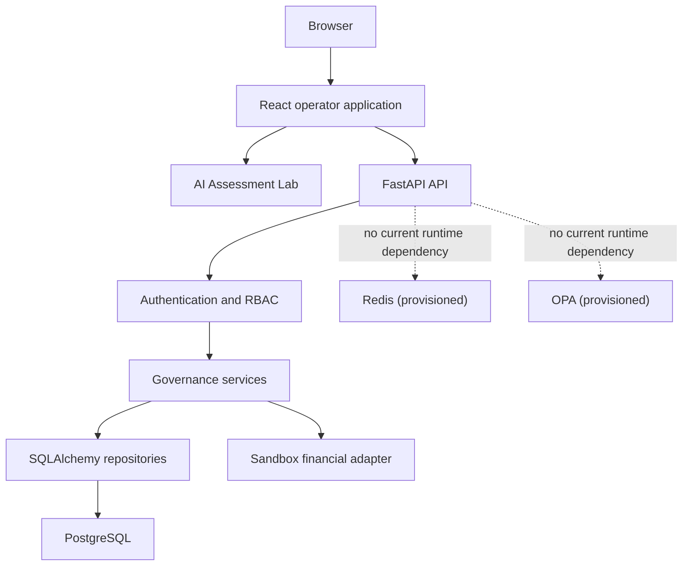

# System architecture

The operational control path is React → FastAPI → service → repository → PostgreSQL. The sandbox
adapter is reachable only through the financial-action service after status, policy, and budget
checks. The Assessment Lab runs deterministic analysis in the browser and does not write
operational financial records.

Docker Compose starts the frontend, backend, PostgreSQL, Redis, and OPA. The latter two are
provisioned extension points and are deliberately not shown as active enforcement dependencies.
