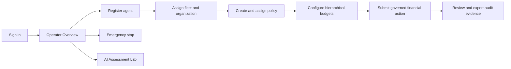

# UX flow

The platform opens on the authenticated Overview. Governance setup proceeds from scope to policy
to budget. Execution results return to the dashboard and Audit Center. Emergency control remains a
separate, high-salience path. The Assessment Lab is a secondary workflow for AI risk evaluation.
